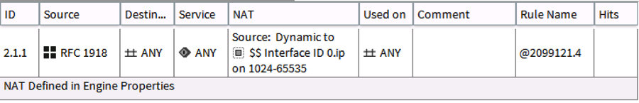

Deploy
======

Deployment of Stonesoft NGFW into AWS is done using Layer 3 Firewall mode. It is possible to deploy as
a multi-interface Inline Gateway, or a single interface NAT Gateway. 

Deployment can be done by creating a new VPC and NGFW, or by deploying Stonesoft into an existing VPC.

Add NGFW to existing VPC
------------------------

To add a Stonesoft NGFW to an existing VPC, run ``ngfw_launcher --add -y <path_to_yaml>``.

You will be prompted as follows (region can be placed in YAML config):

::

	Stonesoft AWS Launcher
	======================
	
	Enter a region:
	1) ap-northeast-1
	2) ap-northeast-2
	3) ap-south-1
	4) ap-southeast-1
	5) ap-southeast-2
	6) eu-central-1
	7) eu-west-1
	8) sa-east-1
	9) us-east-1
	10) us-east-2
	11) us-west-1
	12) us-west-2
	
	View available VPC configurations:
	1) vpc-f1e12a98 (172.18.2.0/24)
	2) vpc-f91ef790 (172.31.0.0/16)
	
	Available subnets;
	1) 172.18.2.0/25 (us-east-2b)
	2) all
	
	Choose installation style:
	1) Inline Gateway
	2) NAT Gateway

.. note::
   When deploying as a NAT gateway, a NAT rule should be configured on Stonesoft for the source networks that
   require outbound services

NAT Rule example:
::

	Source: RFC 1918
	Destination: Any
	NAT: Source Dynamic, $$Interface ID 0.ip

Create new VPC and NGFW
-----------------------

To create a Stonesoft NGFW and a VPC, run ``ngfw_launcher --create -y <path_to_yaml>``

.. note:: 
   Creating a VPC requires ``vpc_subnet``, ``vpc_private`` and ``vpc_public`` settings in the
   YAML configuration

When opting to do a create operation, all settings can be pulled directly from the YAML configuration. If you want this to be completely
hands off, populate ``aws_region`` in the YAML file as well or you will be prompted for this information.   

Listing NGFW instances
----------------------

To list Stonesoft NGFW instances in a VPC, run ``ngfw_launcher --list -y <path_to_yaml>``.

You will get a list of instances currently available in the specified VPC.

::

	Stonesoft AWS Launcher
	======================

	View available VPC configurations:
	1) vpc-f1e12a98 (172.18.2.0/24)
	2) vpc-f91ef790 (172.31.0.0/16)

	Instance ID           |Availability Zone   |Type        |State       |Launch Time 
	i-001e6ea3d4f499a01   |us-east-2b          |t2.micro    |running     |2016-12-28 01:58 UTC

Removing NGFW
-------------

To remove Stonesoft NGFW from AWS, run ``ngfw_launcher --remove -y <path_to_yaml>``.

You will be prompted as follows (region can be placed in YAML config):

::

	Stonesoft AWS Launcher
	======================
	
	View available VPC configurations:
	1) vpc-f1e12a98 (172.18.2.0/24)
	2) vpc-f91ef790 (172.31.0.0/16)
	
	Remove NGFW instances;
	1) i-0d7b8be886384ab97 (us-east-2b)
	2) all
